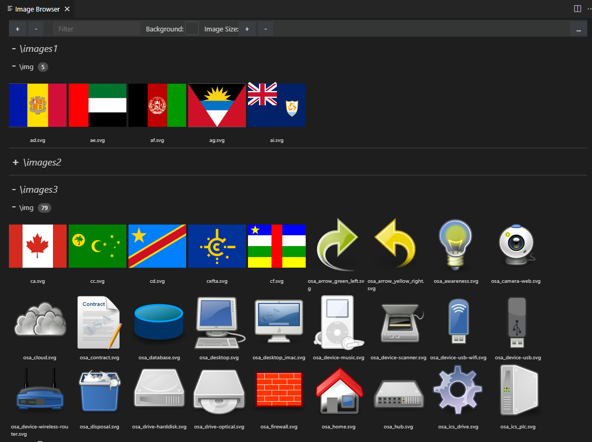

# Project Image Browser

This is a VSCode extension that allows you to view all of the images in your project collated into a single webview. The webview can be opened using a context menu in explorer pane.

Inspired by [Image Viewer](https://github.com/ZhangJian1713/vscode-image-viewer) but entirely rewritten to simplify the implementation of new features and allow VSCode theming of the webview.

Features:
- Support for workspaces with multiple root folders, including selectively including/excluding them.
- Webview matches VSCode theming
- Multiple backgrounds available for images, including checkboards. More added on request.
- Image name filtering
- Basic include/exclude filters (regex filtering tbd)

Most, but not quite all, configuration can be altered from within the webview. 



## Development

The code is based on the [Hello World](https://github.com/microsoft/vscode-webview-ui-toolkit-samples/tree/main/default/hello-world) sample extension that demonstrates how to set up and use a [SolidJS](https://www.solidjs.com/) + [Webview UI Toolkit](https://github.com/microsoft/vscode-webview-ui-toolkit) webview extension.

Once you've pulled the repo you need to install dependencies.
```bash
# Navigate to project folder

# Install dependencies for both the extension and webview UI source code
npm run install:all

# Build webview UI source code
npm run build:webview

# Open project in VS Code
code .
```
Note that when you change the webview you must rebuild it using the NPM script (bottom of explorer window) or the command above.